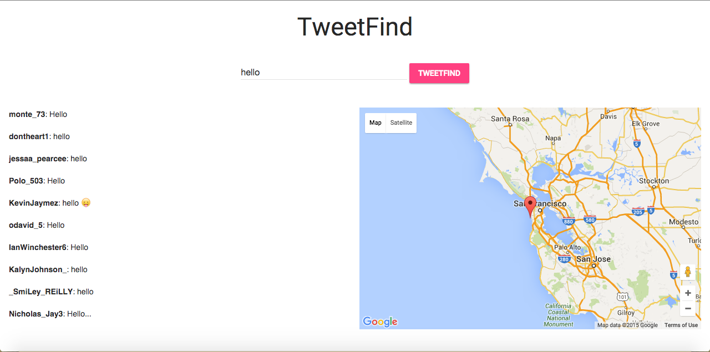

TweetFind - Tweets Search Engine based on PyLucene
===========================================

TweetFind is a search engine which indexes and queries tweets crawled by TweetBot.

The software was built and tested on a Mac OS X, but should work fine on other UNIX based Systems. However, it may not work on Windows.

For the software to work, the person needs to have installed PyLucene(Python Wrapper for Lucene) and Flask(a Python MVC Framework). 

Installation
------------

###Clone the repository
```bash
git clone https://github.com/tweetbot/tweetfind.git
```

###Install PyLucene

```bash
#On mac, first install brew using
ruby -e "$(curl -fsSL https://raw.githubusercontent.com/Homebrew/install/master/install)" 

#Install PyLucene
brew install pylucene
```

###Install Flask

```bash
#First you need to install pip
#On mac, to install pip, run
sudo easy_install pip
#update
sudo pip install --upgrade pip

#Install Flask
pip install flask
```
###Tutorial

-	Navigate to the home directory and type `/.run.py`. This will launch the Flask Web Server and start serving the web application which uses PyLucene in its back end to return the search results.


-	Launch your web browser and navigate to `localhost:5000`.


-	Type your query in the search box.


-	Click on a tweet to see its location on map.

